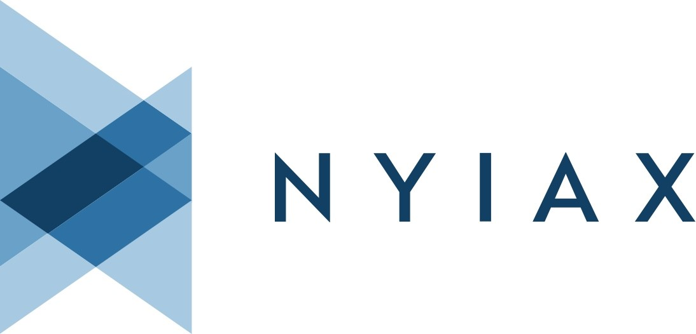

<h1 align="center">Привет, я Даша!
  </h1>
</h1>

<h3 align="center">QA Engineer</h3>

Работала над проектами компаний

А сейчас работаю в

над проектом

### My stats:

<!--
**da-shutka/da-shutka** is a ✨ _special_ ✨ repository because its `README.md` (this file) appears on your GitHub profile.

Here are some ideas to get you started:

- 🔭 I’m currently working on ...
- 🌱 I’m currently learning ...
- 👯 I’m looking to collaborate on ...
- 🤔 I’m looking for help with ...
- 💬 Ask me about ...
- 📫 How to reach me: ...
- 😄 Pronouns: ...
- ⚡ Fun fact: ...
-->
